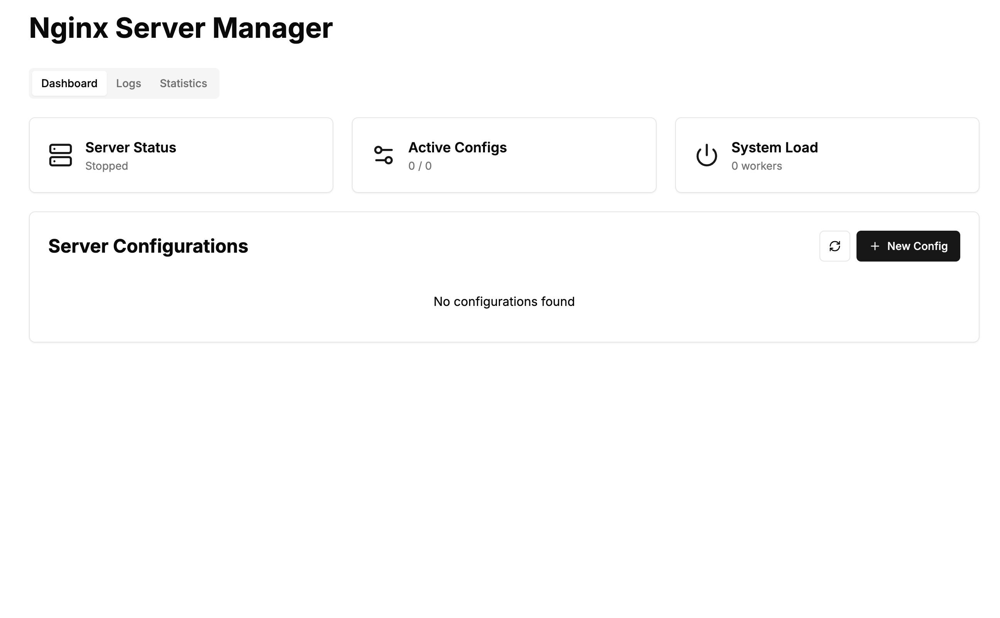

# Nginx Manager

Un gestionnaire de serveur Nginx moderne avec interface graphique, monitoring en temps réel et gestion SSL automatisée.



## 🚀 Fonctionnalités

- 📊 **Monitoring en temps réel**
  - Connexions actives
  - Utilisation CPU/Mémoire
  - Bande passante
  - Requêtes par seconde
- 🔧 **Gestion des configurations**
  - Création/modification de configurations
  - Activation/désactivation de sites
  - Support des virtual hosts
  - Gestion des reverse proxies
- 🔒 **Gestion SSL automatisée**
  - Intégration Let's Encrypt
  - Renouvellement automatique
  - Configuration HTTPS simplifiée
- 📈 **Statistiques avancées**
  - Codes de statut HTTP
  - Chemins les plus visités
  - IPs les plus actives
  - Temps de réponse moyen

## 🛠️ Technologies

- **Frontend**

  - Next.js 13.5
  - React 18
  - TypeScript
  - Tailwind CSS
  - shadcn/ui
  - Recharts
  - WebSocket

- **Backend**
  - Node.js
  - WebSocket Server
  - Nginx API
  - Certbot

## 📦 Installation

1. **Prérequis**

   ```bash
   # Installation de Nginx
   sudo apt update
   sudo apt install nginx

   # Installation de Certbot
   sudo apt install certbot python3-certbot-nginx
   ```

2. **Installation du projet**

   ```bash
   # Cloner le dépôt
   git clone https://github.com/espero-soft/nginx-manager.git
   cd nginx-manager

   # Installation des dépendances
   npm install

   # Build du projet
   npm run build

   # Démarrage en production
   npm start
   ```

## 🔧 Configuration

1. **Configuration Nginx**

   - Les fichiers de configuration sont stockés dans `/etc/nginx/`
   - Sites disponibles : `/etc/nginx/sites-available/`
   - Sites activés : `/etc/nginx/sites-enabled/`

2. **Configuration SSL**

   - Les certificats sont gérés par Let's Encrypt
   - Stockage : `/etc/letsencrypt/live/`

3. **Variables d'environnement**
   ```env
   NGINX_CONFIG_DIR=/etc/nginx
   NGINX_LOG_DIR=/var/log/nginx
   SSL_DIR=/etc/letsencrypt/live
   ```

## 📚 Documentation API

### Endpoints REST

- `GET /api/nginx`

  - Liste toutes les configurations
  - Retourne : `NginxConfig[]`

- `POST /api/nginx`

  - Crée/modifie une configuration
  - Corps : `{ action, configName, config, ssl, source, email }`

- `GET /api/nginx/logs`

  - Récupère les logs d'accès
  - Retourne : `AccessLogEntry[]`

- `GET /api/nginx/stats`
  - Statistiques de trafic
  - Paramètres : `minutes`
  - Retourne : `TrafficStats`

### WebSocket

- `ws://host/api/nginx/realtime`
  - Métriques en temps réel
  - Format : `RealTimeMetrics`

## 🔐 Sécurité

- Authentification requise pour toutes les opérations
- Validation des configurations avant application
- Sauvegarde automatique avant modifications
- Isolation des processus Nginx

## 🤝 Contribution

Les contributions sont les bienvenues ! Voir [CONTRIBUTING.md](CONTRIBUTING.md) pour les détails.

## 📝 License

MIT License - voir [LICENSE](LICENSE) pour plus de détails.

## 👤 Auteur

**AKPOLI Espero**

- Email: contact@espero-soft.com
- Site: [https://espero-soft.com](https://espero-soft.com)
- GitHub: [@espero-soft](https://github.com/espero-soft)

## 🙏 Remerciements

- L'équipe Nginx pour leur excellent serveur web
- La communauté Let's Encrypt pour la sécurisation du web
- Tous les contributeurs qui améliorent ce projet

---

Fait avec ❤️ par [Espero-Soft](https://espero-soft.com)# server_nginx_manager
